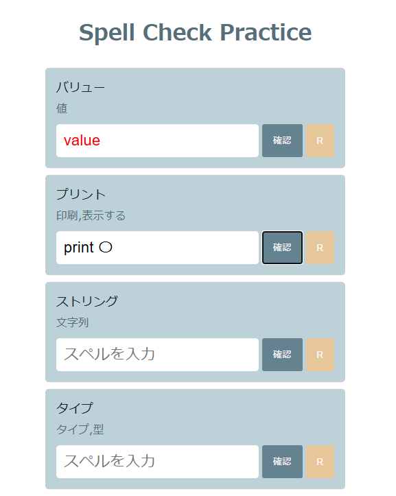

# Spell Check Practice

簡単なスペル練習アプリです。英語の読みと意味から正しいスペルを入力する練習ができます。

## スクリーンショット

## 使い方

1. `index.html`をブラウザで開きます。
- 最初にカタカナ読みと、下の段に単語の意味・説明が表示されています。
2. 入力欄にスペルを入力し、「確認」ボタンを押します。
- 正解すると入力した単語の右側に〇が表示されます。
- 不正解だと正解が赤文字で表示されます。
- 「R」ボタンでリセットできます。

## 開発環境・技術
- HTML / CSS / JavaScript

## 利用について
このプロジェクトは学習目的で作成したものです。特に制限はありませんので、自由に使用・改変してください！
ただし、動作保証はしませんので自己責任でお願いします。
